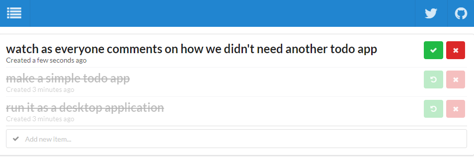

## To Do

Just a local storage todo list. That is all I want for quick notes.



## Desktop App

I built this as a replacement for Notepad on desktop. All I needed was a quick list to take notes in, no cloud storage necessary. To use this as a desktop app install [Nativefier](https://github.com/jiahaog/nativefier) and run `nativefier --name ToDo --single-instance https://todo.theconnman.com`. This will create a local executable. Move the whole folder wherever you'd like and create a shortcut for easy startup.

## Local Development

To run locally run the following:

```
git clone https://github.com/TheConnMan/todo.git
cd todo/
yarn
yarn start
// navigate to localhost:3000
```
